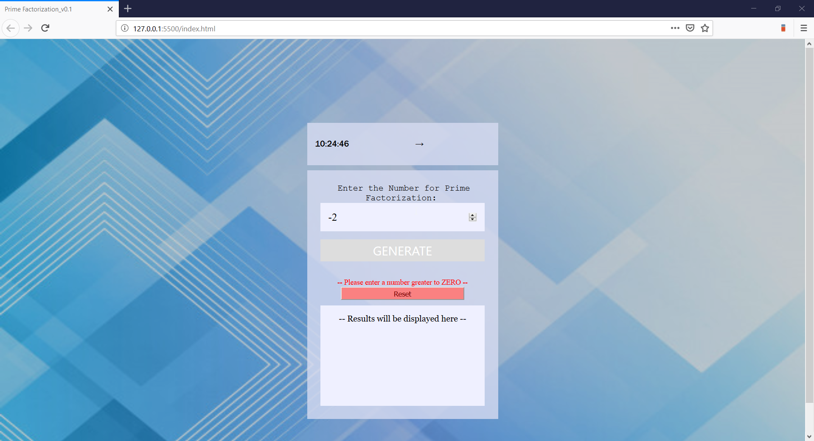
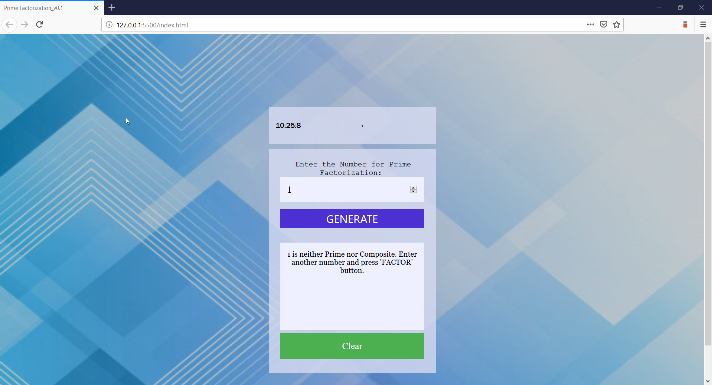
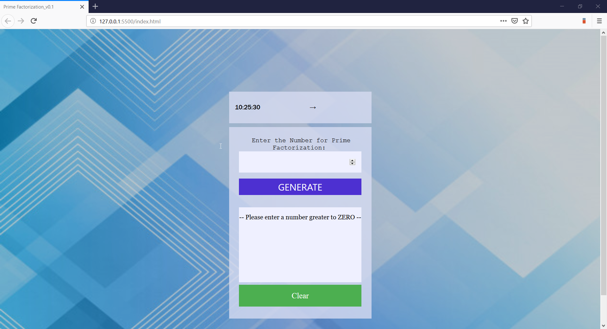
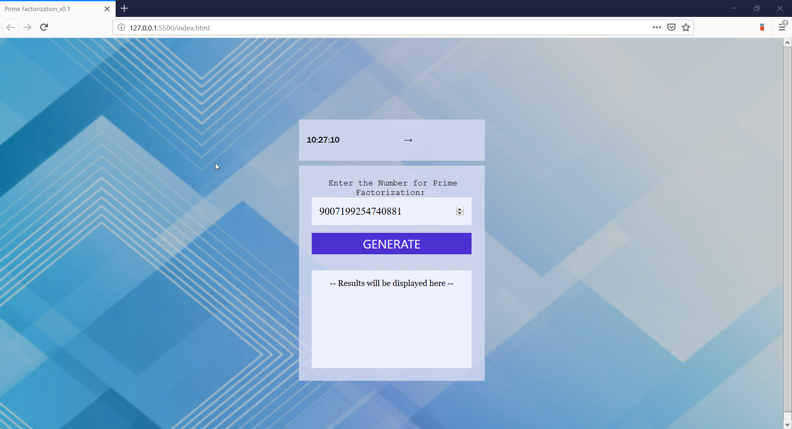

PRIME FACTORIAL GENERATOR

TABLE OF CONTENTS\
	<pre> INTRODUCTION	</pre>
	<pre> SPECIFICATIONS	</pre>
	<pre> SOFTWARES REQUIRED	</pre>
	<pre> SOURCE CODE	</pre>
	<pre> INSTALLATION NOTES	</pre>
	<pre> ABOUT THE APPLICATION	</pre>
	<pre> TEST CASES	</pre>

INTRODUCTION
<pre>	The Prime Factorial Generator takes a positive number as input and generates its Prime Factors. </pre>
<pre>	Assumption: Prime Factors not possible for negative numbers. Refer to answer one of https://primes.utm.edu/notes/faq/negative_primes.html </pre>

REQUIREMENTS
<pre>	When a page loades, the following information should be provided:</pre>
		<ul>
			<li> A Clock displaying the current time in 24 hr format.</li>
			<li> A timer spinner that cycles every 125ms</li>
			<li> An Input field</li>
			<li> A GENERATE button which when clicked generates all the prime factors for the given input.</li>
			<li> A Results Area</li>
			<li> A CLEAR Button but is hidden until Results area is populated with Factors</li>
			<li> A RESET Button but is hidden until the Input abides by the constraints mentioned below</li>
			<li> A RESET button which when clicked clears all the generated prime factors for the given input. The button should also reset the Input field and clear the Error messages if any.</li>
			<li> An Error area which is displayed whenever the user provides inputs which do not follow the constraints.</li>
		</ul>
		
<pre>	When the User provides an input, it should comply with the following constraints:</pre>
		<ul>
			<li> The number should be positive and greater than Zero (0)</li>
		</ul>
	
<pre>	When the user provides a valid input and clicks on the GENERATE Button:</pre>
		<ul>
			<li> Default message must be displayed until the factors are calculated.</li>
			<li> Default message must be displayed until the factors are calculated.</li>
			<li> The generated Factors must be populated replacing the default message in the Results area.</li>
			<li> CLEAR button must be displayed</li>
		</ul>
		
<pre>	When the user provides invalid input:</pre>
		<ul>
			<li> Error message must be displayed</li>
			<li> GENERATE Button must be de-activated.</li>
			<li> RESET button must be activated</li>
		</ul>
		
SOFTWARES REQUIRED
<pre>	The software that are needed for the application to be edited or executed </pre>
	<ul>
	<li> ‘browser’ --> Any latest browser like Chrome, Firefox or Safari.</li>
	</ul>

SOURCE CODE
<pre>	The Source code for the application is in the ‘PrimeFactorialGenerator’ folder</pre>
	<ul>
	<li> ‘index.html’ --> This file has the javascript and jQuery source code for the application.</li>
	<li>‘styles.css’ --> This file has the styling for the page.</li>
	</ul>

INSTALLATION NOTES
<pre>	Simply double click on the 'index.html' file or Right-click on the 'index.html' file and open it in any browser of your choice.</pre>

ABOUT THE APPLICATION
<pre>	This application loads and allows the user to feed a positive number as Input and generate its Prime Factors. The application begins at the page displayed in screen shown in Figure 1.</pre> 

	

Figure 1: Load-up screen and also Reset screen
	
<pre>	If the user provides an in-valid input then the screen show in Figure 2 is displayed.</pre>
	

	Figure 2: Screen with Error message for in-appropriate Inputs.
	
TEST CASES
<pre>	If the user provides an valid input but there are no prime factors for it then the screen show in Figure 3 is displayed.</pre>
	

Figure 3: Screen when the numeric One is attempted to be factored.

<pre>	If the user provides an no input then the screen show in Figure 4 is displayed. </pre>
	

Figure 4: Screen when blank input is attempted to be factored.

<pre>	If the user provides a valid input then the screen show in Figure 5 is displayed.</pre>
	

Figure 5: Screen for normal number prime factorization.

<pre>	If the user provides a valid large input (9007199254740881) then the screen show in Figure 6 is displayed.</pre>
	

Figure 6: Screen for large number prime factorization.

